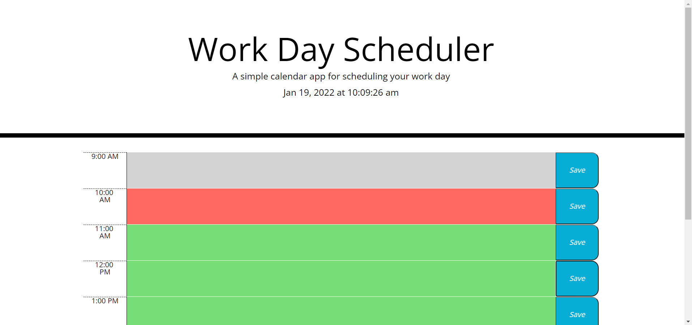

# Day Planner

  

  ## Table of Contents
  - [Description](#Description)
  - [Installation](#Installation)
  - [Usage](#Usage)
  - [Tests](#Tests)
  - [License](#License)
  - [Questions](#Questions)

  

  ## Description
  This project allows you to input tasks or To Do's into a 9-5 workday planner. The planner displays the current time at the top of the page, and the text boxes change color relative to the current hour of the day. Hitting save stores the user's input for later use.

  ## Installation
  N/A

  ## Usage
  N/A

  ## Tests
  undefined

  ## License
  
   
  This application uses no license.

  ## Questions
  You can contact me for questions at my [email](mailto:cwishart203@gmail.com), or you can go to my [GitHub](https://github.com/cwishart203).

  ## Addtional Contributors
  N/A
